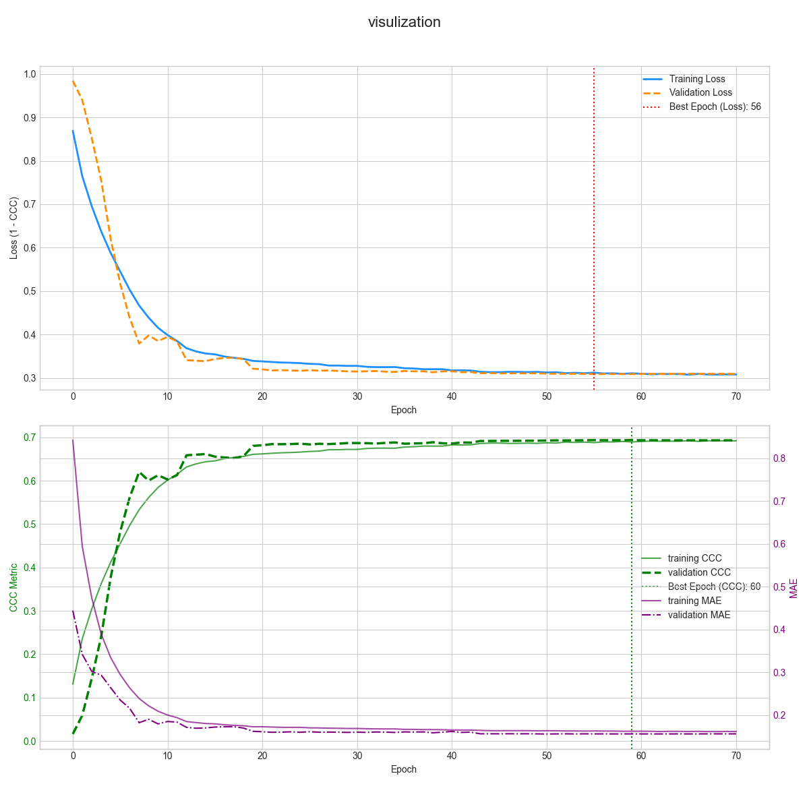

# MER: Cochleogram + Transformer + Dense VA Sequence

## How to run
1. Prepare env\
tensorflow==2.5.0 \
cuda:11.2 (for linux)

2. Download data\
After extracting the dataset, place it in the project's root directory.

3. Run\
//todo

## Result
### Transformer:
Test Loss (CCC Loss): 0.26246070861816406\
Test Mean Absolute Error (MAE): 0.15273113548755646\
Test Concordance Correlation Coefficient (CCC): 0.7344589829444885
-------------------------
Valence - Concordance Correlation Coefficient (CCC): 0.7058\
Valence - Mean Absolute Error (MAE):             0.1487\
\
Arousal - Concordance Correlation Coefficient (CCC): 0.7788\
Arousal - Mean Absolute Error (MAE):             0.1568
--------------------------

